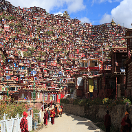

# rcan-tensorflow
Image Super-Resolution Using Very Deep Residual Channel Attention Networks Implementation in Tensorflow

[ECCV 2018 paper](https://arxiv.org/pdf/1807.02758.pdf)

[Orig PyTorch Implementation](https://github.com/yulunzhang/RCAN)

## Introduction
This repo contains my implementation of RCAN (Residual Channel Attention Networks).

Here're the proposed architectures in the paper.

- Channel Attention (CA)

- Residual Channel Attention Block (RCAB)

- Residual Channel Attention Network (RCAN), Residual Group (GP)

**All images got from [the paper](https://arxiv.org/pdf/1807.02758.pdf)**

## Dependencies
* Python
* Tensorflow 1.x
* tqdm
* h5py
* scipy
* cv2

## DataSet

| DataSet |        LR       |        HR        |
|  :---:  |    :-------:    |    :-------:     |
|  DIV2K  |  800 (192x192)  |   800 (768x768)  |
 
## Usage
### training
    # hyper-paramters in config.py, you can edit them!
    $ python3 train.py --data_from [img or h5]
### testing
    $ python3 test.py --src_image sample.png --dst_image sample-upscaled.png

## Results

* OOM on my machine :(... I can't test my code, but maybe code runs fine.

| Example\Resolution | *192x192x3 image (sample)* | *768x768x3 image (generated)* |
|    :-------:       |     :-------:     |     :-------:     |
|  Example1  |  |  |

## To-Do
1. Data Augmentation (rotated by 90, 180, 280 degrees)

## Author
HyeongChan Kim / [@kozistr](http://kozistr.tech)
